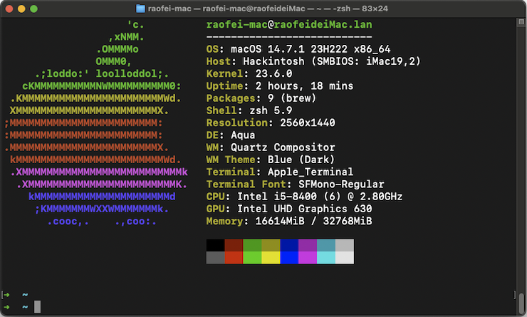

#### OpenCore  Ventura|Sonoma  EFI For  Z370 AORUS Gaming 3 (rev. 1.0)  

##### 摘要

本EFI的SSDT来自OLARILA的一个0.8.8的版本，不过直接使用OpenCore官方Coffee Lake指导配置的SSDT也是可以的，这个版本不解锁CFG Lock的情况下，通过配置Kernel -> Quirks -> AppleXcpmCfgLock为布尔True，可以正常安装Ventura 13.7，但是升级到Sonoma14.7 可能会出现黑屏或者反复重启。我的版本主要是对这个问题进行修复并升级到**1.0.2**版OpenCore，从而顺利升级到Sonoma 14.7版本


##### 当前状态

Ventura :white_check_mark:，Sonoma :white_check_mark:，Sequoia :information_source:

声卡				:white_check_mark:\
显卡				:white_check_mark:\
网卡				:white_check_mark:\
USB状态		:white_check_mark:\
休眠唤醒		:white_check_mark:\

##### 硬件配置

CPU：Intel 8th i5-8400
主板：GIGABYTE Z370 AORUS Gaming 3 (rev. 1.0)  (BIOS Version F15)
内存：光威Glory DDR4 3200	32G
显卡：核显UHD630
声卡：板载ALC1220
硬盘：ADATA 256G SSD
电源：GreatWall 750瓦

##### 操作步骤

1. BIOS配置

   在win下面使用官方@BIOS工具将BIOS版本刷到最新的F15版本，中途会重启3次，禁止干预重启，耐心等待。

   + Load Optimized Defaults

   + 内存开启X.M.P，不是必须，不同规格内存混插将不会出现这个选项 

   + 关闭Secure Boot

   + 关闭Fast Boot

   + 关闭CSM Support

   + 关闭VT-d

   + 关闭Intel Platform Trust Technology，使用PE安装器可以安装Win11,它只是标准安装的时候验证

   + 开启 USB配置的XHCI Hand Off

   + 开启集显的4G EnCoding

   + 显示输出选择igfx表示使用内建显卡, 若独立显卡则选Slot 1,这里不考虑独显

   + DVMT Pre Allocated 改为128M

   + 开启电源RC6(Render Standby)

     

2. 手动解锁CFG Lock

   + 不解锁也是可以通过配置config.plist来安装Ventura 13.7的, 无法安装Sonoma不确定是否与此有关

   + 下载set_dump GUI 工具，下载本主板最新F15的BIOS文件，使用set_dump GUI 打开BIOS文件，在搜索框输入CFG Lock ，经过几秒的等待，就可以看到CFG Lock的配置地址如0x5A4，记住这个地址，不同版本的BIOS这个值会不同

   + 下载modGRUBShell.efi,放到OpenCore的OC目录下的Tools目录中，并使用OCAT或者ProperTree导入到配置中并保存

   + 重启电脑进入OpenCore菜单选择modGRUBShell进入，并执行如下命令

     ```
     # 注意这个地址用大写，具体地址根据你前面获取的来填，这个命令返回0x01表示CFG Lock是锁定
     setup_var 0x5A4
     # 确认锁定后执行解锁,然后再执行上面的查询，返回0x00则成功了，执行exit退出
     setup_var 0x5A4 0x00
     ```

   + 解锁之后，config.plist中的AppleCpuPmCfgLock和AppleXcpmCfgLock 都要Disable

     

3. 配置config.plist注意事项，EFI文件已经完成如下配置，根据自己的情况修改

   + **重要**，PlatformInfo机器信息请选择**iMac 19,2**或者iMac pro 1,1作为model生成自己的三码，**不要使用我配置中的三码**,需要注意的是iMac 19,2 Model没有T2芯片检测，安装之后可以接收升级推送，iMac pro 1,1 的黑苹果无法收到升级，需要通过RestrictEvents.kext驱动并配合启动参数revpatch=sbvmm （虚拟机模式）来实现升级推送，升级完可以移除。

   + 为了提高UEFI模式启动内存兼容和稳定性，Booter做如下改动：

     Booter -> Quirks: AvoidRuntimeDefrag, DevirtualiseMmio, ProtectUefiServices, ProvideCustomSlide, RebuildAppleMemoryMap, SetupVirtualMap 和 SyncRuntimePermissions = True

   + DeviceProperties -> Add -> PciRoot(0x0)/Pci(0x1F,0x3) 的device-id一定要是自己主板声卡的device-id,这个可以通过aida64在win中查看，如果显示设备ID是8086 A2F0，那么这里就要填写成F0A20000，注意要倒过来，否则无法识别声卡ALC1220，请根据aida64查询的值来填写。

   + DeviceProperties -> Add -> PciRoot(0x0)/Pci(0x2,0x0) -> AAPL,ig-platform-id 这个值Coffee lake台式机可选值**`07009B3E`**和**`00009B3E`**，这两个值都是代表一种设备接口规则（在WhatEverGreen文档中有专门的对照表），表示有3个输出端口，后者是台式的3输出，后面这个值兼容性更好一些,安装Sonoma推荐用这个值；device-id是核芯显卡的设备id,可以通过gpu-z查询到，同样的倒过来写，看到3E92就填923E0000

   + **这里可能是安装Sonoma反复黑屏重启的主要原因**，安装过程中视频没有输出，不是安装卡死，因为敲键盘有系统声音反馈。所以需要做如下修复，确保0，1，2三个输出口配置一样，目的是让HDMI输出口能够正常工作：

     增加键 DeviceProperties -> Add -> PciRoot(0x0)/Pci(0x2,0x0) ->force-online  值Data类型01000000

     增加键 DeviceProperties -> Add -> PciRoot(0x0)/Pci(0x2,0x0) ->framebuffer-con0-enable 值Data类型01000000

     增加键 DeviceProperties -> Add -> PciRoot(0x0)/Pci(0x2,0x0) ->framebuffer-con0-type  值Data类型00080000表示HDMI
   
     (二选一)增加键 DeviceProperties -> Add -> PciRoot(0x0)/Pci(0x2,0x0) ->enable-hdmi-dividers-fix 值布尔类型True
   
     (二选一)增加键 NVRAM -> Add -> 7C436110-AB2A-4BBB-A880-FE41995C9F82 ->boot-args 引导参数添加：
     
      -igfxhdmidivs  igfxonln=1 **推荐这种方式**，优先级最高，声卡的alcid=3 （这个Layout-id要自己试，每种声卡都有这个layout-id table查询）也可以在这里设置, 两个选项可以同时配置，启动命令优先生效
     
   

##### 注意避坑

1. 主板型号不同但CPU一样，使用我的EFI有可能成功，但不建议直接使用，错误的ACPI可能会导致BIOS重置
2. 使用通用的SSDT-USBX.aml(USB电源管理),SSDT-AWAC.aml(时钟修复),SSDT-EC.aml(模拟EC嵌入式控制器以加载电源驱动),SSDT-PLUG.aml(CPU电源管理)通常可以正常引导安装，如果OpenCore使用了通用acpi方式，建议安装完系统之后，使用ssdttime生成更加完整的ssdt来修复潜在的不兼容
3. 如果上述操作有重启死循环，可以考虑临时将SecureBootModel临时改为Disable，DisableSecurityPolicy临时改为True试试


##### 参考


> [EliteMacx86 Forum](https://elitemacx86.com/threads/gigabyte-z370-aorus-gaming-3-intel-core-i5-8400-32gb-ram-amd-rx-580-opencore.718/)
>
> [Z370 AORUS Gaming 3 (rev. 1.0) 支持与下载 ](https://www.gigabyte.cn/Motherboard/Z370-AORUS-Gaming-3-rev-10/support#support-dl-driver)
>
> [Desktop Coffee Lake | OpenCore Install Guide](https://dortania.github.io/OpenCore-Install-Guide/config.plist/coffee-lake.html#deviceproperties)
>
> [Release Final Ventura OC EFI · kinoute/Hack-Z370-HD3P-i5-8400](https://github.com/acidanthera/WhateverGreen/blob/master/Manual/FAQ.IntelHD.cn.md)
>
> [声卡Layout表](https://github.com/acidanthera/AppleALC/wiki/Supported-codecs)
>
> [acidanthera/RestrictEvents](https://github.com/acidanthera/RestrictEvents)